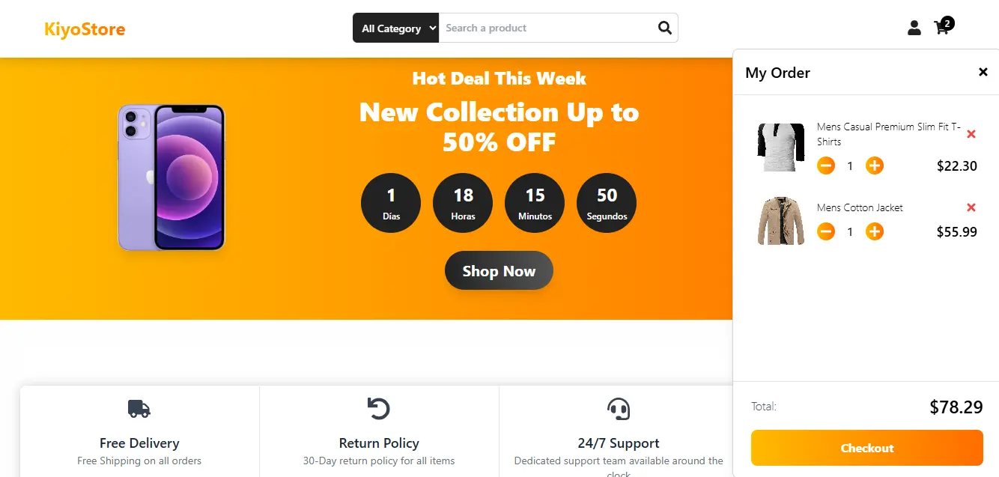

# KiyoStore


## Índice

1. [Descripción](#descripción)
2. [Características principales](#características-principales)
3. [Tecnologías utilizadas](#tecnologías-utilizadas)
4. [Instalación y configuración](#instalación-y-configuración)

## Descripción

KiyoStore es una moderna y completa aplicación de comercio electrónico (“e-commerce”) desarrollada con React.js, Tailwind CSS, y Firebase. Diseñada para proporcionar una experiencia de usuario ágil, atractiva y funcional, KiyoStore incluye una variedad de características avanzadas como autenticación, gestión de carrito, filtros, y más.

## Características principales

1. **Diseño responsivo**: La interfaz está completamente optimizada para adaptarse a diferentes dispositivos y tamaños de pantalla.

2. **Gestor de productos**: Los usuarios pueden explorar productos filtrando por categoría y título.

3. **Carrito de compras**: Los productos pueden:
   - Agregar al carrito.
   - Incrementar o disminuir la cantidad.
   - Eliminar del carrito.
   - La vista de carrito muestra el total acumulado y la lista completa de productos seleccionados.

4. **Detalle del producto**: Los usuarios pueden ver los detalles completos de cada producto antes de agregarlo al carrito.

5. **Historial de compras**: Se puede ver una lista de los productos comprados, con la fecha del checkout y el total de la compra.

6. **Autenticación**: Los usuarios pueden:
   - Registrarse y crear una cuenta.
   - Iniciar sesión y acceder a sus datos.
   - Cerrar sesión de forma segura.

7. **My Account**: Los usuarios pueden:
   - Editar su información personal (teléfono, correo, etc.).
   - Cambiar su contraseña.

8. **Lazy Loading**: Las imágenes de los productos utilizan Intersection Observer para cargarse de forma diferida, mejorando el rendimiento general de la aplicación.

9. **Persistencia de datos**: Se utilizó localStorage para persistir ciertos datos, como la cuenta regresiva de ofertas.

10. **Cuenta regresiva**: La sección de ofertas incluye un contador que muestra el tiempo restante para promociones especiales.

## Tecnologías utilizadas

- **React.js**: Framework principal para el desarrollo de la interfaz de usuario.
- **Tailwind CSS**: Librería de estilos para un diseño rápido y responsivo.
- **Firebase**: Autenticación y gestión de datos en tiempo real.
- **JavaScript**: Lógica principal de la aplicación.
- **Vite**: Herramienta para el desarrollo rápido de aplicaciones React.
- **pnpm**: Gestor de paquetes para manejar dependencias.

### Hooks y herramientas clave

- **useState**: Para gestionar el estado local de los componentes.
- **useEffect**: Para manejar efectos secundarios, como la persistencia de datos o peticiones a la base de datos.
- **useContext**: Para compartir datos globales como el estado de autenticación y el carrito.
- **useMemo**: Para optimizar cálculos pesados y evitar renders innecesarios.
- **useCallback**: Para memorizar funciones y mejorar el rendimiento.
- **React Router**: Para gestionar las rutas y la navegación dentro de la aplicación.

## Instalación y configuración

1. **Clonar el repositorio**:

   ```sh
   git clone https://github.com/usuario/kiyostore.git
   cd kiyostore

2. **Instalar dependencias**:
   ```sh
   pnpm install

3. **Configurar Firebase**:
   Crear un proyecto en Firebase.
   Obtener las credenciales (API Key, Auth Domain, etc.) y agregarlas al archivo .env.
    ````
    VITE_FIREBASE_API_KEY=your_api_key
    VITE_FIREBASE_AUTH_DOMAIN=your_auth_domain
    VITE_FIREBASE_PROJECT_ID=your_project_id
    VITE_FIREBASE_STORAGE_BUCKET=your_storage_bucket
    VITE_FIREBASE_MESSAGING_SENDER_ID=your_sender_id
    VITE_FIREBASE_APP_ID=your_app_id

4. **Ejecutar el proyecto en modo desarrollo **:

    ```sh
    pnpm run dev
